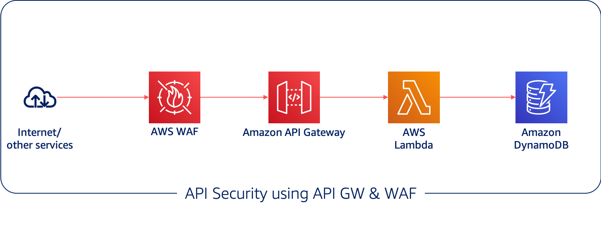

# Security best practices in Amazon API Gateway: Throttling & Web Application Firewall

Mystique Unicorn App is a containerized microservice made of many APIs. One of the API is open to the public and they encourage their users to build services on top of this API. Althought this API is public, they are looking to protect this API from abuse. For example, they do not want one user to aggressive poll the api and degrade the performance for other users. Another use case they would like to defend against is from bot like requests coming from the same source IPs.

## 🎯Solutions

AWS WAF is a web application firewall that helps to protect web applications and APIs from attacks. It enables you to configure a set of rules (called a web access control list (web ACL)) that allow, block, or count web requests based on customizable web security rules and conditions that you define.

Miztiik Corp can add web ACLs and rate-based rules to act on sudden spikes in traffic that might indicate a potential DDoS event. A rate-based rule counts the requests that arrive from any individual address in any five minute period. If the number of requests exceeds the limit(_say for example `133` requests per second_)defined by you, the rule can trigger an action such as sending you a notification.

In addition to having security at the edge with WAF, Miztiik Corp can also throttles requests to the API at the API Gateway. You can set the limits for individual API `stages` or `methods`. When incoming request exceed the request rate and burst limits, API Gateway fails the limit-exceeding requests and returns `429 Too Many Requests` error responses to the client. This will ensure the service degradation and alleviates the _noisy neighbour_ problem.

_Note:_ By default, API Gateway limits the steady-state request rate to `10000` requests per second (rps). It limits the burst (that is, the maximum bucket size) to `5000` requests across all APIs within an AWS account.



In this article, we will build the above architecture. using Cloudformation generated using [AWS Cloud Development Kit (CDK)][102]. The architecture has been designed in a modular way so that we can build them individually and integrate them together. The prerequisites to build this architecture are listed below

1.  ## 🧰 Prerequisites

    This demo, instructions, scripts and cloudformation template is designed to be run in `us-east-1`. With few modifications you can try it out in other regions as well(_Not covered here_).

    - 🛠 AWS CLI Installed & Configured - [Get help here](https://youtu.be/TPyyfmQte0U)
    - 🛠 AWS CDK Installed & Configured - [Get help here](https://www.youtube.com/watch?v=MKwxpszw0Rc)
    - 🛠 Python Packages, _Change the below commands to suit your OS, the following is written for amzn linux 2_
      - Python3 - `yum install -y python3`
      - Python Pip - `yum install -y python-pip`
      - Virtualenv - `pip3 install virtualenv`

1.  ## ⚙️ Setting up the environment

    - Get the application code

      ```bash
      git clone https://github.com/miztiik/secure-api-with-throttling.git
      cd secure-api-with-throttling
      ```

1.  ## 🚀 Prepare the dev environment to run AWS CDK

    We will cdk to be installed to make our deployments easier. Lets go ahead and install the necessary components.

    ```bash
    # If you DONT have cdk installed
    npm install -g aws-cdk

    # Make sure you in root directory
    python3 -m venv .env
    source .env/bin/activate
    pip3 install -r requirements.txt
    ```

    The very first time you deploy an AWS CDK app into an environment _(account/region)_, you’ll need to install a `bootstrap stack`, Otherwise just go ahead and deploy using `cdk deploy`.

    ```bash
    cdk bootstrap
    cdk ls
    # Follow on screen prompts
    ```

    You should see an output of the available stacks,

    ```bash
     unthrottled-api
     secure-throttled-api
     waf-stack
     load-generator-vpc-stack
     miztiik-artillery-load-generator
    ```

1.  ## 🚀 Deploying the application

    Let us walk through each of the stacks,

    - **Stack: unthrottled-api**
      We are going to deploy a simple `greeter` api running as a lambda function. This API is deployed as public endpoint without any throttling or WAF to protect it. The lambda function also does not have any reserved concurrency. This allows the lambda to consume the all the free unused concurrency limits. Although this might be a useful behaviour, in some cases like an DDoS attack, this behaviour is undesirable.

      When the api is invoked, It returns a simple welcome message along with a timestamp. We should be able to invoke the function from a browser or using an utility like `curl`.

      Initiate the deployment with the following command,

      ```bash
      cdk deploy unthrottled-api
      ```

      _Expected output:_
      The `UnthrottledApiUrl` can be found in the outputs section of the stack,

      ```json
      {
        "message": "Hello Miztiikal World, It is 2050-08-10 21:18:05.1891331 here! How about there?"
      }
      ```

      We will later use a load testing tool like `artillery` to generate a lot of requests against this url. If you end up overwhelming your API GW, it will respond back with `500` errors

    - **Stack: secure-throttled-api**

      This stack:_secure-throttled-api_ is very much similar to the previous stack. We will also add API throttling in this stack. We will start with a very very conservative limit of `throttling_rate_limit` of `10` and `throttling_burst_limit` of`100`.

      Initiate the deployment with the following command,

      ```bash
      cdk deploy secure-throttled-api
      ```

      Check the `Outputs` section of the stack to access the `SecureApiUrl`

    - **Stack: secure-throttled-api**

      This stack:_secure-throttled-api_ is very much similar to the previous stack. We will also add API throttling in this stack. We will start with a very very conservative limit of `throttling_rate_limit` of `10` and `throttling_burst_limit` of`100`.

      Initiate the deployment with the following command,

      ```bash
      cdk deploy secure-throttled-api
      ```

      Check the `Outputs` section of the stack to access the `SecureApiUrl`

    - **Stack: waf-stack**

      To protect our secure api at the edge, we will deploy an Web Application Firewall. As of now, Cloudformation does not support creating rate based rules, so we will use a custom resource to do the same. I have built a very modest rate limit of `133`. If any IP address is sending more than `133` requests per 5 minute period, that IP will be blocked until it falls below the threshold in any 5 minute period.

      Initiate the deployment with the following command,

      ```bash
      cdk deploy waf-stack
      ```

1.  ## 🔬 Testing the solution

    We need a tool/utility to generate 100's or 1000's or requests simulating a real-world use case. We can use the community edition of the `artillery` for this purpose. We will build a VPC and host an EC2 instance that can run this tool. _Additional Activity, Do try this at home: Run artillery as a fargate task_

    The _Outputs_ section of the `secure-private-api` stack has the required information on the urls

    - We need to invoke the `SecureApiUrl` from the same VPC. To make it easier to test the solution, I have created another template that will deploy an EC2 instance in the same VPC and in the same security group as the API Gateway. You can login to the instances using [Systems Manager](https://www.youtube.com/watch?v=-ASMtZBrx-k). You can deploy this stack or create your own instance.

      Initiate the deployment with the following command,

      ```bash
      cdk deploy load-generator-vpc-stack
      cdk deploy miztiik-artillery-load-generator
      ```

    - Connect to the EC2 instance using Session Manager - [Get help here](https://www.youtube.com/watch?v=-ASMtZBrx-k)

      - Switch to bash shell `bash`
      - Install `nodejs`

        ```bash
        # https://docs.aws.amazon.com/sdk-for-javascript/v2/developer-guide/setting-up-node-on-ec2-instance.html
        curl -o- https://raw.githubusercontent.com/nvm-sh/nvm/v0.34.0/install.sh | bash
        . ~/.nvm/nvm.sh
        nvm install node
        # Confirm Node is installed properly
        node -e "console.log('Running Node.js ' + process.version)"
        # Install artilleruy
        npm install -g artillery
        # Setup log file location to save artillery test results
        sudo touch /var/log/miztiik-load-generator-unthrottled.log
        sudo touch /var/log/miztiik-load-generator-throttled.log
        sudo chown ssm-user:ssm-user /var/log/miztiik-load-generator-*
        ```

    Now we are all almost set to bombard our APIs with requests. As the first step, let us set our API url as environment variables. Ensure you change the values from the appropriate stack

    ```bash
    UNTHROTLLED_API_URL="https://s05negye01.execute-api.us-east-1.amazonaws.com/miztiik-unthrottled/unsecure/greeter"
    SECURE_API_URL="https://x8btuv3d81.execute-api.us-east-1.amazonaws.com/miztiik-throttled/secure/greeter"
    ```

    The below artillery request will generate about 1500 requests, simulating the arrival of 5 users per second and each generating one request. We have also informed artillery to add new users for about 5 minutes(_300 seconds_). In a real-world scenario, you might want to throw much bigger requests at your workloads. If you are testing and playaround with the services, this can be a good starting point.

    ```bash
    artillery quick -d 300 -r 5 -n 1 ${UNTHROTLLED_API_URL} >> /var/log/miztiik-load-generator-unthrottled.log &
    artillery quick -d 350 -r 5 -n 1 ${SECURE_API_URL} >> /var/log/miztiik-load-generator-throttled.log &
    ```

    Expected Output,

        Get the list of IP addresses blocked by rate-based rules

        ```bash
        aws wafv2 get-rate-based-statement-managed-keys --scope=REGIONAL --region=us-east-1 --web-acl-name=apiSentryAclwaf-stack --web-acl-id=b4d665ec-151a-44cd-a8ec-b147136faa52 --rule-name=rps_110
        ```

        ```bash
        ]$ aws wafv2 get-rate-based-statement-managed-keys \
            --scope REGIONAL \
            --region us-east-1 \
            --web-acl-name apiSentryAclwaf-stack \
            --web-acl-id b4d665ec-151a-44cd-a8ec-b147136faa52 \
            --rule-name rps_110

          {
              "ManagedKeysIPV4": {
                  "IPAddressVersion": "IPV4",
                  "Addresses": [
                      "3.236.176.254/32"
                  ]
              },
              "ManagedKeysIPV6": {
                  "IPAddressVersion": "IPV6",
                  "Addresses": []
              }
          }
        ```

        You should be able to see the public IP address of EC2 instances being blocked by WAF. This IP will be automatically unblocked by WAF if the requests fall below the threshold in any `5-Minute` period.

        _Additional Learnings:_ You can check the logs in cloudwatch for more information or increase the logging level of the lambda functions by changing the environment variable from `INFO` to `DEBUG`

1.  ## 🧹 CleanUp

    If you want to destroy all the resources created by the stack, Execute the below command to delete the stack, or _you can delete the stack from console as well_

    - Resources created during [deployment](#-resource-deployment-using-aws-cdk)
    - Delete CloudWatch Lambda LogGroups
    - _Any other custom resources, you have created for this demo_

    ```bash
    # Delete from cdk
    cdk destroy cognito-identity-provider

    # Follow any on-screen prompts

    # Delete the CF Stack, If you used cloudformation to deploy the stack.
    aws cloudformation delete-stack \
        --stack-name "MiztiikAutomationStack" \
        --region "${AWS_REGION}"
    ```

    This is not an exhaustive list, please carry out other necessary steps as maybe applicable to your needs.

## 📌 Who is using this

This repository to teaches cloudformation to new developers, Solution Architects & Ops Engineers in AWS. Based on that knowledge these Udemy [course #1][103], [course #2][102] helps you build complete architecture in AWS.

### 💡 Help/Suggestions or 🐛 Bugs

Thank you for your interest in contributing to our project. Whether it's a bug report, new feature, correction, or additional documentation or solutions, we greatly value feedback and contributions from our community. [Start here][200]

### 👋 Buy me a coffee

[](https://ko-fi.com/Q5Q41QDGK)Buy me a [coffee ☕][900].

### 📚 References

1. [Throttle API requests for better throughput][1]

1. [Troubleshoot API Gateway private API endpoint issues][2]

1. [Security best practices in Amazon API Gateway][3]

1. [Controlling and managing access to a REST API in API Gateway][4]

1. [Protecting APIs using AWS WAF][5]

1. [Access private REST API in another account using an interface VPC endpoint][6]

1. [IAM policy examples for API execution permissions][7]

1. [VPC endpoint policies for private APIs in API Gateway][8]

1. [DNS with AWS Client VPN endpoint][10]

### 🏷️ Metadata

**Level**: 300


https://docs.aws.amazon.com/waf/latest/APIReference/API_UpdateWebACL.html
https://aws.amazon.com/premiumsupport/knowledge-center/api-gateway-troubleshoot-403-forbidden/

[1]: https://docs.aws.amazon.com/apigateway/latest/developerguide/api-gateway-request-throttling.html
[2]: https://aws.amazon.com/premiumsupport/knowledge-center/api-gateway-private-endpoint-connection/
[3]: https://docs.aws.amazon.com/apigateway/latest/developerguide/security-best-practices.html
[4]: https://docs.aws.amazon.com/apigateway/latest/developerguide/apigateway-control-access-to-api.html
[5]: https://aws.amazon.com/blogs/compute/protecting-your-api-using-amazon-api-gateway-and-aws-waf-part-i/
[6]: https://www.youtube.com/watch?v=UnoVqaTGwzM
[7]: https://aws.amazon.com/blogs/compute/protecting-your-api-using-amazon-api-gateway-and-aws-waf-part-2/
[8]: https://aws.amazon.com/blogs/compute/building-well-architected-serverless-applications-controlling-serverless-api-access-part-2/
[100]: https://www.udemy.com/course/aws-cloud-security/?referralCode=B7F1B6C78B45ADAF77A9
[101]: https://www.udemy.com/course/aws-cloud-security-proactive-way/?referralCode=71DC542AD4481309A441
[102]: https://www.udemy.com/course/aws-cloud-development-kit-from-beginner-to-professional/?referralCode=E15D7FB64E417C547579
[103]: https://www.udemy.com/course/aws-cloudformation-basics?referralCode=93AD3B1530BC871093D6
[200]: https://github.com/miztiik/secure-private-api/issues
[899]: https://www.udemy.com/user/n-kumar/
[900]: https://ko-fi.com/miztiik
[901]: https://ko-fi.com/Q5Q41QDGK
